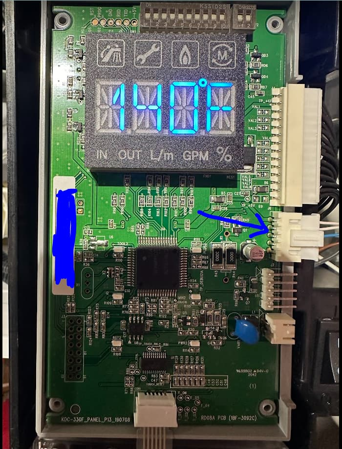
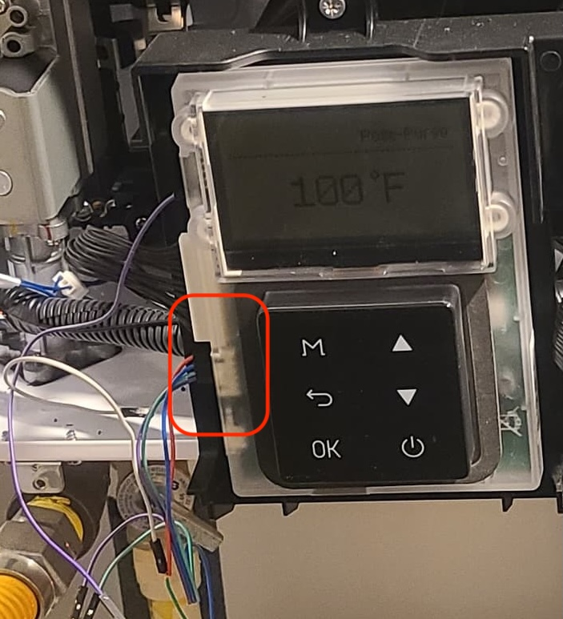
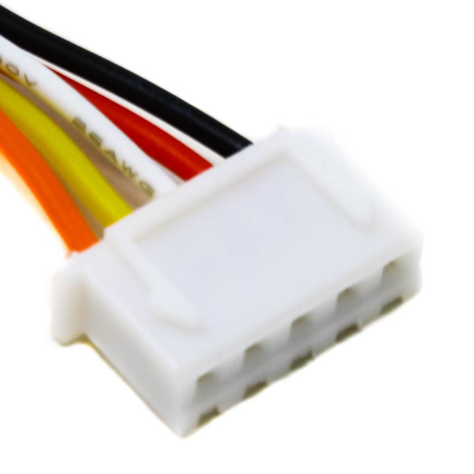
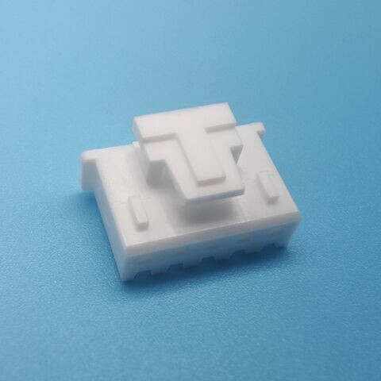
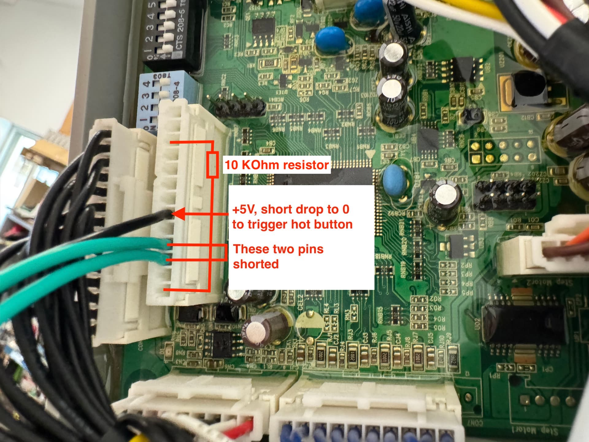
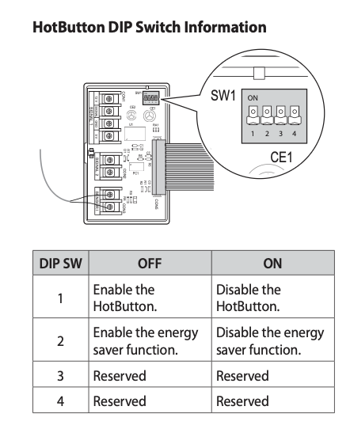
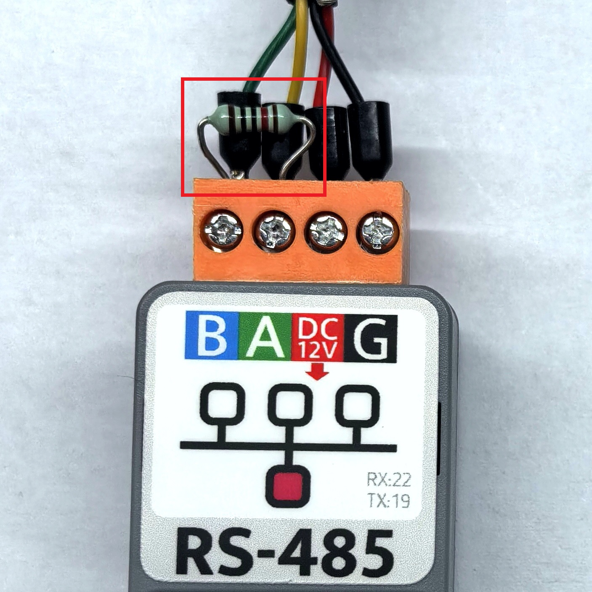
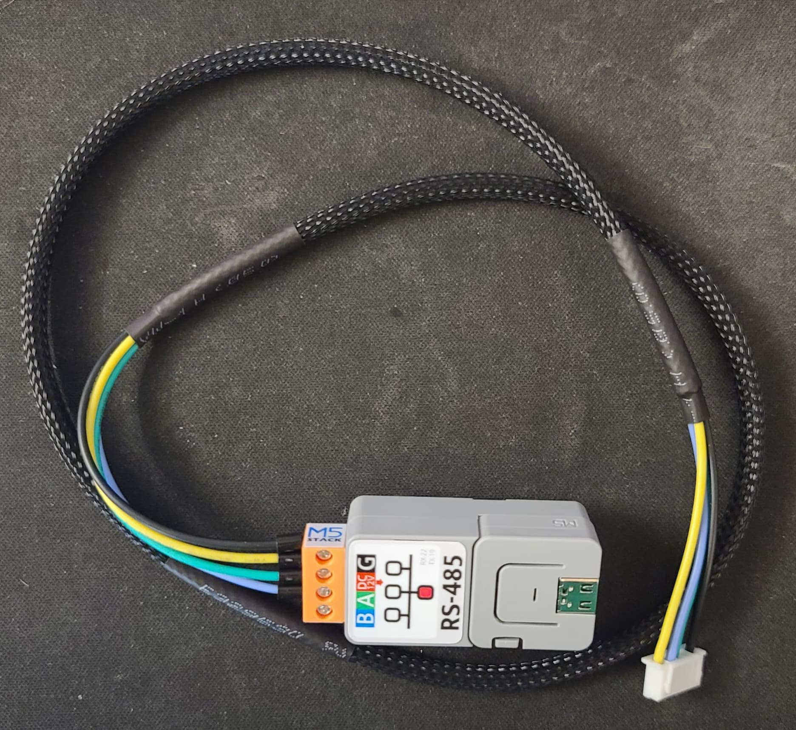

# Hardware Build Guide — RS485 Adapter for Navien

This guide summarizes everything you need to build a working RS485 adapter for your Navien tankless water heater, based on hundreds of posts from the [Home Assistant community thread](https://community.home-assistant.io/t/navien-esp32-navilink-interface/720567). It covers the Navien-side connector, four proven hardware options, wiring tables, and the common mistakes people make.

For full installation and parameter details, refer to the [Navien NPE-A/S Installation Manual](https://www.navieninc.com/downloads/npe-a-s-manuals-installation-manual-en).

---

## Before You Start: Enable NaviLink in the Installer Menu

**This is the single most common reason for a completely silent RS485 bus.** If the NaviLink communication mode is not enabled, your Navien unit sends no RS485 traffic at all, regardless of your hardware.

Access the installer menu as follows:

1. From the home screen, press and hold **Menu** and **↩ (back arrow)** simultaneously for 3 seconds. The service installer menu will appear.
2. Choose **option 1** to enter the installer menu and press **OK**.
3. Enter the default password **1234** using the up/down arrow buttons, then press **OK**.
4. Select **option 3 — Application Settings**, press **OK**.
5. Select **option 1 — NaviLink**, press **OK**.
6. Select **option 1 — NaviLink Connection**, press **OK**. Read the info screen and press **OK** again.
7. Move the cursor to **Enable** under NaviLink Connection and press **OK**.
8. Press **↩** repeatedly to exit all menu screens. The unit will reboot and purge the lines. Your ESP should then begin reporting data.

> **Note:** Units manufactured before approximately 2016 do not support NaviLink and cannot be used with this project.

---

## Physical Connector on the Navien Unit

The RS485 data connector is a **JST XH (2.54 mm pitch), 5-pin** connector located on the front display panel of the unit — the same port where the NaviLink Lite cable plugs in.

To access it:
1. Power off the Navien unit and unplug it from the wall.
2. Remove the front panel (typically two screws at the top, two at the bottom).
3. The RS485 connector is the 5-pin JST XH jack on the front display board.

|  |  |
|:---:|:---:|
| **Navien 240A** — RS485 connector is left of the back-arrow button | **Navien 240A2** — same connectors, mirrored position |

|  |  |
|:---:|:---:|
| 5-pin JST XH connector on the **Navien 240A** front panel | 5-pin JST XH connector on the **Navien 240A2** front panel (green PCB visible to the right of the display) |

### 5-Pin Connector 1 — RS485 Data

| Pin | Purpose |
|-----|---------|
| 1 | ~+13 V (Navien 240A) |
| 2 | RS-485 B− |
| 3 | RS-485 A+ |
| 4 | Unknown / unused |
| 5 | GND |

### Mating Connector — JST XH vs XHB

The Navien uses a **JST XH** socket (2.54 mm pitch). You need a mating plug to connect your cable. There are two variants:

| | JST XH | JST XHB |
|---|---|---|
| Locking clip | No | Yes — a small plastic tab that clicks into place |
| Fits Navien socket | Yes | Yes |

Both variants are electrically identical and physically compatible with the Navien socket. The XHB locking clip is a convenience feature — the plain XH plug holds securely enough for a permanent install.

**Where to buy:**
- [Amazon — ACEIRMC 10-pair 5-pin JST **XH** connectors (male + female)](https://www.amazon.com/ACEIRMC-10Pairs-Connector-Connectors-Compatible/dp/B0D3LZHSTP)
- [AliExpress — JST **XHB** 5-pin connector set (locking)](https://www.aliexpress.us/item/3256806321864401.html)

|  |  |
|:---:|:---:|
| JST XH — no locking clip | JST XHB — locking clip |

### Hot Button Requirement

The **hot button** feature (triggering instant hot water recirculation) requires two things: the Navien hot button kit must be installed on the main board, and the unit must be configured to **External HotButton** recirculation mode. If the mode is not set correctly, the Hot Button entity in Home Assistant will do nothing when pressed.

Whether the hardware is pre-installed depends on your model:

- **NPE-240A2** — the hot button kit comes **pre-installed**. No additional steps needed.
- **Other models (e.g. NPE-240A, NPE-210S)** — the hot button kit is **not included**. You must either purchase and install the official Navien hot button kit, or make the DIY bypass described below.

#### DIY Hot Button Bypass (13-pin JST XH connector)

The main board has an empty 13-pin JST XH socket where the hot button board plugs in. You can simulate the hot button kit by plugging a JST XHP-13 connector into that socket with two pins shorted together, and a wire on the +5 V pin that your ESP32 can pull low to trigger a hot button press.

> The 13-pin connector is **JST XH** (plain, no locking clip) — not XHB.

|  |
|:---:|
| Annotated 13-pin connector. The embedded labels describe triggering a physical hot button press via a relay. The pin labelled "+5V" is a digital input that is pulled high — to trigger the hot button, pull it to 0 V. If you only want RS485-based virtual hot button (no relay), you need just 4 pins total: the two pins shorted together, and the 10 KΩ resistor |

#### Hot Button DIP Switches

The hot button controller board has a 4-position DIP switch (SW1) that controls its behavior:

| DIP SW | OFF | ON |
|--------|-----|----|
| 1 | Enable the HotButton | Disable the HotButton |
| 2 | Enable the energy saver function | Disable the energy saver function |
| 3 | Reserved | Reserved |
| 4 | Reserved | Reserved |

|  |
|:---:|
| SW1 DIP switch on the hot button controller board |

#### Temperature Sensor and SENSOR I Contacts

The hot button controller has a **SENSOR I** input for an optional recirculation return-line temperature sensor. By default, two metal contacts on SENSOR I are bridged by a metal plate — this is the no-sensor configuration and works without modification.

If you want to connect a temperature sensor, remove the metal plate before connecting the sensor. **Do not leave the plate installed while connecting a sensor, as this will short the sensor input.**

For most users: leave the metal plate in place and skip the temperature sensor entirely.

#### Fixture Distance (Parameter 16)

When no temperature sensor is connected (the default), the unit uses **Parameter 16** (fixture distance) to determine when to stop recirculating. The default value is **30 ft**. Adjust this parameter to match the approximate distance from the water heater to the furthest fixture if your setup differs significantly.

### RS485 Signal Levels

The Navien RS485 bus operates at standard RS485 differential levels (±12 V swing). Your RS485 transceiver IC handles the conversion to 3.3 V/5 V TTL logic for the ESP — **no separate level shifter is needed** on the RS485 data lines.

**UART settings for all configurations:**
- Baud rate: **19200**
- Data bits: 8
- Stop bits: 1
- Parity: None

---

## Hardware

The recommended build is the **M5Stack AtomS3 Lite + Atomic RS485 Base**. The base snaps onto the bottom of the AtomS3 Lite, accepts 12 V input directly from the Navien connector, and provides regulated power to the AtomS3 Lite. No breadboard or soldering required for the ESP side.

**Parts:**
- M5Stack AtomS3 Lite (ESP32-S3)
- [M5Stack Atomic RS485 Base](https://docs.m5stack.com/en/atom/Atomic%20RS485%20Base)
- JST XHP-5 (plain) or XHB (locking) 5-pin connector + wire, or pre-made cable

> **Termination resistor:** There is conflicting information about whether the Atomic RS485 Base includes an integrated 120 Ω termination resistor. The [latest schematics](https://docs.m5stack.com/en/atom/Atomic%20RS485%20Base) suggest it does; however, an [M5Stack example project](https://docs.m5stack.com/en/arduino/projects/atomic/atomic_rs485_232_base) calls for adding an external one. Other M5Stack RS485 products also ship with a loose through-hole resistor in the package — if yours does, use it across the A and B terminals. Do not add an external resistor if the base already has one integrated, as two resistors in parallel would drop the effective termination resistance below the correct 120 Ω. A unit ordered in June 2026 worked correctly without adding an external resistor.

|  |
|:---:|
| 120 Ω resistor across the A and B terminals (highlighted) |

|  |
|:---:|
| Very nicely made custom cable with heat shrink, wire loom, and ferrules. Uses JST-XH connectors. |

**Wiring:**

| Atomic RS485 Base Terminal | Navien Connector 1 |
|----------------------------|--------------------|
| B | Pin 2 (RS-485 B−) |
| A | Pin 3 (RS-485 A+) |
| 12V | Pin 1 (~+13 V) |
| GND | Pin 5 (GND) |

> Powering the base from the Navien's Pin 1 (+13 V) works reliably. The Atomic RS485 Base accepts 12–32 V input and provides regulated power to the AtomS3 Lite.

**UART pins (AtomS3 Lite):**

| Signal | GPIO |
|--------|------|
| TX | GPIO2 |
| RX | GPIO1 |

**ESPHome YAML:** [`navien-esphome-atoms3-lite-rs485base-esp32.yml`](esphome/navien-esphome-atoms3-lite-rs485base-esp32.yml)

### ESPHome Configuration

The easiest way to get started is to import the board config directly in the ESPHome dashboard using the **Import from URL** option with this URL:

```
github://jhenkens/esphome-navien/esphome/navien-esphome-atoms3-lite-rs485base-esp32.yml@main
```

This generates a minimal local config that pulls the full component definition from GitHub at build time. You only need to add your wifi credentials:

```yaml
substitutions:
  device_name: navien-abc123
  friendly_name: Navien abc123

packages:
  navien.board: github://jhenkens/esphome-navien/esphome/navien-esphome-atoms3-lite-rs485base-esp32.yml@main

esphome:
  name: ${device_name}
  name_add_mac_suffix: false
  friendly_name: ${friendly_name}

api:
  encryption:
    key: <your generated key>

wifi:
  ssid: !secret wifi_ssid
  password: !secret wifi_password
  ap:
    ssid: ${device_name} AP
    password: !secret ap_password
```

Updates to the shared component config are picked up automatically on the next compile — no need to re-import.

---

## Common Mistakes

1. **NaviLink not enabled in the installer menu.** The most common cause of a completely silent bus. Follow the steps at the top of this guide.

2. **RS485 A/B wires reversed.** If you get garbage data or silence, swap A and B.

3. **Termination resistor.** See the note in the Hardware section above — whether to add one depends on your specific unit.

4. **Wrong on/off byte values.** The NPE-240A and NPE-240A2 use different byte values for power state. Make sure you're using the right config file for your unit.

5. **ESPHome version.** Version 2025.7.4 introduced breaking changes. Use **2025.11.4 or later**.

---